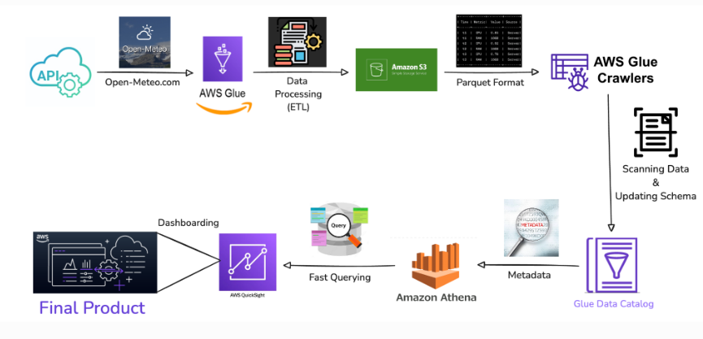

# Weather Analytics Dashboard

## 1. Business Challenge
- Weather conditions significantly impact various industries
  - Transportation, agriculture, energy sectors, etc.
- Real-time and historical weather data are often unstructured
  - Difficult to analyze trends and derive useful insights
- We can solve this by building a scalable, cloud-based Weather Analytics Dashboard
  - To processes, transform, and visualize weather data efficiently.

## 2. Business Solution
 We propose building an AWS-based Weather Analytics Dashboard that:
 - Fetches weather data from Open-Meteo API.
 - Processes data using AWS Glue.
 - Stores transformed data in AWS S3 (Parquet format).
 - Uses a Crawler to update the schema.
 - Enables fast querying using Amazon Athena.
 - Creates visual reports using Amazon QuickSight for data-driven decision-making.

## Architechture Diagram 

